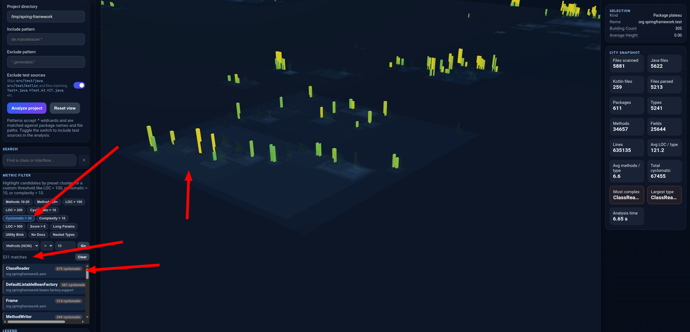
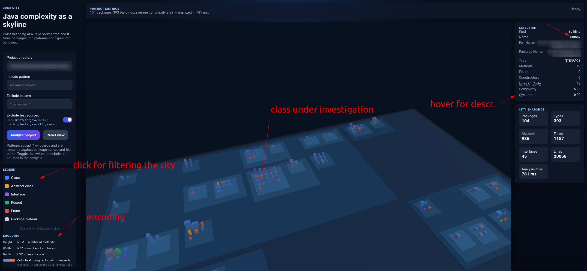
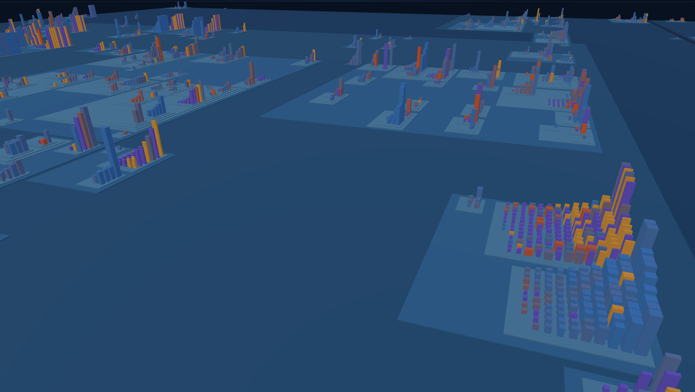

# Code City


Click on Image to See a Video Sample of Code City in Action

[](https://youtu.be/sKPnl18Tad8)

Code City turns a Java or Kotlin project into a 3D cityscape.

Packages become plateaus. Classes, interfaces, enums, records, and abstract classes (Java) or classes, interfaces, objects, and data classes (Kotlin) become buildings. The more code and branching a type has, the taller the building gets. The goal is not perfect static analysis theology; the goal is a fast visual feel for structure and complexity.

## Inspiration and Credit

Huge props to **Richard Wettel** for the original software-city metaphor and the foundational research that inspired this tool.

- Website: https://wettel.github.io/
- Papers:
  - *Software Systems as Cities* (ICSE Doctoral Symposium, 2009): https://wettel.github.io/download/Wettel09a-icse-doctoral.pdf
  - Publication context and related work are referenced in `README_metrics.md`

As far as we can tell, the original CodeCity project is not actively maintained anymore, but it is still extremely useful inspiration for modern tooling.

### Example cityscapes

Multiple Java and/or Kotlin projects at the top level create distinct base plateaus stacked as nested districts:







## What it does

- Scans a directory tree for `.java` and `.kt` (Kotlin) files
- Supports include and exclude patterns such as `de.marcelsauer.*` or `*.generated.*`
- Parses Java and Kotlin source with JavaParser
- Calculates simple structural metrics per top-level type
- Renders the result as an interactive 3D city in the browser with Three.js
- Ships as a Spring Boot application with the frontend bundled into the jar
- Can also produce platform-specific runtime images via `jpackage`

## How the city mapping works

- Package -> plateau
- Class/interface/enum/record/abstract class (Java) -> building
- Class/interface/object/data class (Kotlin) -> building
- Height -> NOM (number of methods)
- Width -> NOA (number of attributes/fields)
- Depth -> LOC (lines of code)
- Building color -> total cyclomatic heat palette (violet low -> yellow high, log-scaled)
- Type distinction -> legend filters + selection details

## Search & Navigation

Use the **Search** panel (sidebar, below the analysis form) to find and focus on specific classes or interfaces:

- Type a name fragment to search (case-insensitive, partial matches work)
- Matching buildings are **highlighted** in the city; everything else is dimmed
- Click a result to smoothly focus the camera on that building and show its metrics
- Press `Esc` in the search box to clear the search

Use the **Metric Filter** panel to highlight likely refactoring candidates by thresholds or clusters:

- Click preset chips such as `LOC > 100`, `Cyclomatic > 10`, `Complexity > 10`, or method-count ranges
- Or build your own filter with a metric, an operator, and a threshold value
- Matching buildings are highlighted and listed, sorted by the strongest offenders first
- Click a result to focus that building and inspect its metrics in the selection panel

### 3D viewport controls

Mouse:

- Left drag: rotate camera
- Right drag: pan view
- Mouse wheel: zoom in/out
- Double click: focus clicked plateau/building

Keyboard (click inside the 3D map first):

- `W A S D` or arrow keys: pan
- `Q` / `E`: rotate left/right
- `+` / `-`: zoom in/out
- `F`: focus whole city
- `R` or `0`: reset camera

This is useful for quickly navigating large codebases or investigating a specific type's complexity and structure.

## Tech stack

- Java 21
- Spring Boot 3
- Gradle Kotlin DSL
- JavaParser
- Vite
- Three.js
- GitHub Actions

## Quick start

### Prerequisites

- Java 21
- Internet access for the first Gradle bootstrap and frontend dependency install

### Scripted workflow

Use the scripts in `scripts/` if you want one-command build, start, and smoke-test runs.

Build everything and start in one go (recommended for dev):

```zsh
./scripts/build-and-start.zsh
```

Build everything (frontend + backend), run tests, and produce the executable jar:

```zsh
./scripts/build-all.zsh
```

Start only (foreground):

```zsh
./scripts/start-only.zsh
```

Start the packaged app and run a sample REST smoke call against `samples/demo-project`:

```zsh
./scripts/start-and-sample-call.zsh
```

What the sample-call script does:

- Starts `backend/build/libs/code-city.jar` (default port `8080`, override with `PORT=...`)
- Calls `GET /api/analyze/health`
- Calls `POST /api/analyze` with a demo payload
- Prints a short summary (packages, buildings, complexity, analysis time)
- Stops the app process automatically

### Run tests and build the application

```zsh
./gradlew clean test backend:bootJar
```

### Start the packaged application

```zsh
java -jar backend/build/libs/code-city.jar
```

Then open:

- `http://localhost:8080`

### Analyze the included demo project

Use this path in the UI (relative to the repo root):

```text
/home/someuser/samples/demo-project
```

Include pattern example:

```text
com.example.demo.*
```

## Development workflow

### Frontend only

```zsh
cd frontend
npm install
npm run dev
```

The Vite dev server proxies `/api` to `http://localhost:8080`.

### Backend only

```zsh
./gradlew :backend:bootRun
```

### Full build

```zsh
./gradlew clean test backend:bootJar
```

## Packaging

### Executable jar

```zsh
./gradlew :backend:bootJar
```

Output:

```text
backend/build/libs/code-city.jar
```

### Native runtime image

This creates a self-contained runtime image for the current platform.

```zsh
./gradlew :backend:jpackageImage
```

Output directory:

```text
backend/build/jpackage/
```

Notes:

- CI builds runtime images for Linux, macOS, and Windows.
- The current setup produces runtime images, not OS installers.
- If you want installers later, flip `skipInstaller = true` in `backend/build.gradle.kts` and add platform-specific packaging metadata.

## Include and exclude patterns

Patterns are matched against package names and relative file paths.

Examples:

- `de.marcelsauer.*`
- `com.acme.billing.*`
- `*.generated.*`
- `*/test/*`

Comma-separated patterns are also supported.

## API

### Health

```text
GET /api/analyze/health
```

### Analyze

```text
POST /api/analyze
Content-Type: application/json
```

Example payload:

```json
{
  "path": "/path/to/project",
  "includePattern": "de.marcelsauer.*",
  "excludePattern": "*.generated.*"
}
```

## Project structure

```text
backend/                 Spring Boot API and analysis engine
frontend/                Vite + Three.js frontend
scripts/                 Helper scripts for build, start-only, and smoke-test runs
samples/demo-project/    Tiny sample Java project for smoke tests
.github/workflows/       CI build and packaging
```

## Metrics reference

For a detailed explanation of every metric collected, how it maps to the visual cityscape,
healthy value ranges, and red-flag patterns, see **[README_metrics.md](README_metrics.md)**.

## Limitations

- The metrics are intentionally lightweight, not a full semantic model.
- Only top-level Java and Kotlin types are rendered as buildings.
- Kotlin metrics are approximated via pattern matching; Java metrics use full AST analysis.
- Very large projects may need future batching or caching.
- The app reads local files from the path you provide, so run it in a trusted local environment.

## Verification done in this workspace

These checks were run locally while building this repo:

```zsh
./gradlew cleanTest :backend:test --rerun-tasks
./gradlew :backend:bootJar
curl http://127.0.0.1:8080/api/analyze/health
curl -X POST http://127.0.0.1:8080/api/analyze \
  -H 'Content-Type: application/json' \
  -d '{"path":"samples/demo-project","includePattern":"com.example.demo.*"}'
```

The packaged app returned:

- 2 packages
- 6 buildings
- 1 interface
- record support confirmed

## License

MIT. See `LICENSE`.

# For me

```bash
#GIT_SSH_COMMAND='ssh -i ~/.ssh/niesfisch' git remote add origin git@github.com:niesfisch/build-monitor.git
#GIT_SSH_COMMAND='ssh -i ~/.ssh/niesfisch' git branch -M main
#GIT_SSH_COMMAND='ssh -i ~/.ssh/niesfisch' git push -u origin main
GIT_SSH_COMMAND='ssh -i ~/.ssh/niesfisch' git pull  
GIT_SSH_COMMAND='ssh -i ~/.ssh/niesfisch' git push origin main  
```
